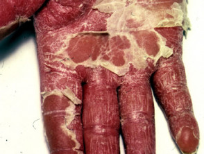
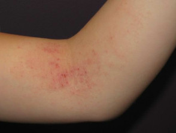
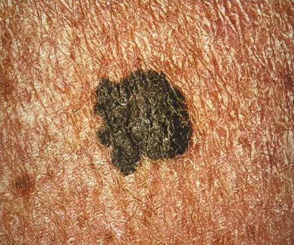
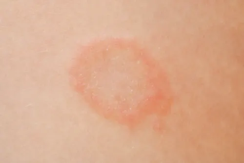
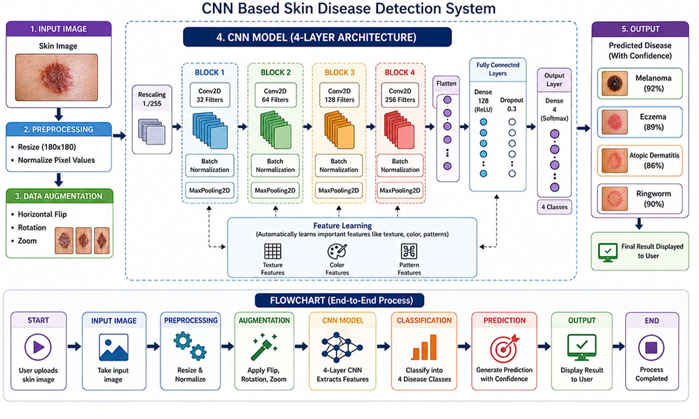
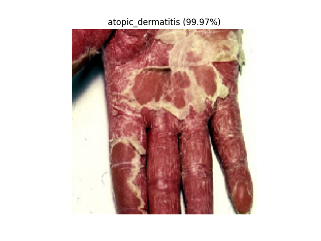
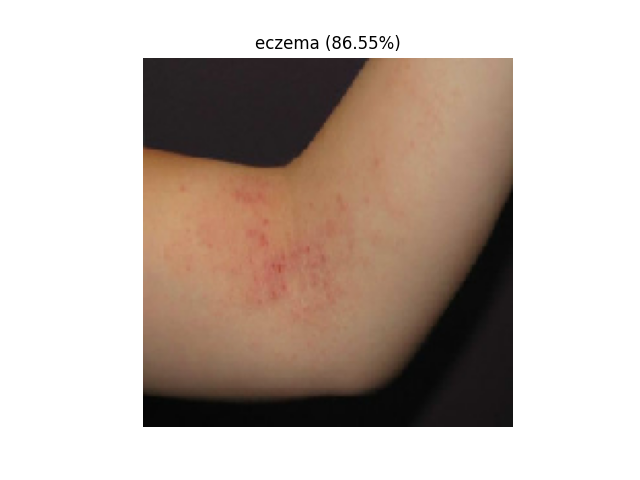
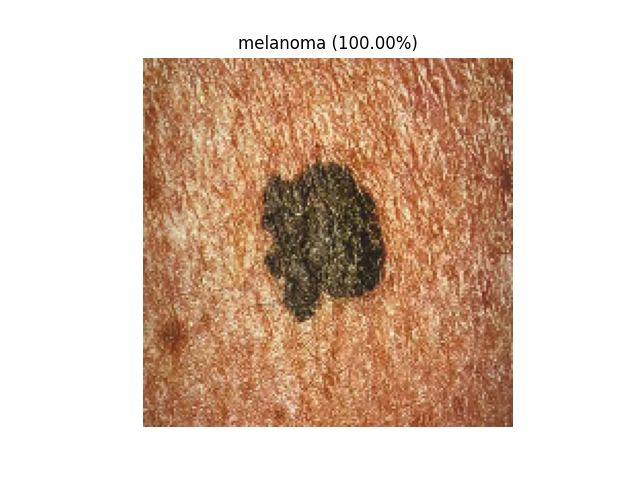
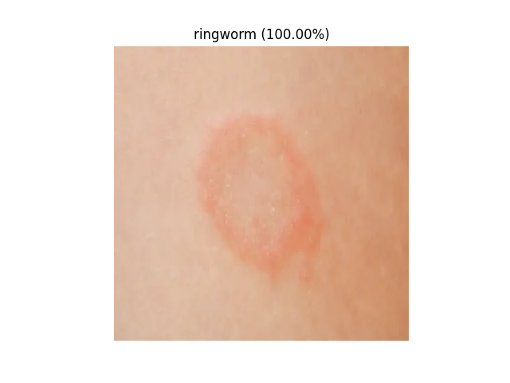
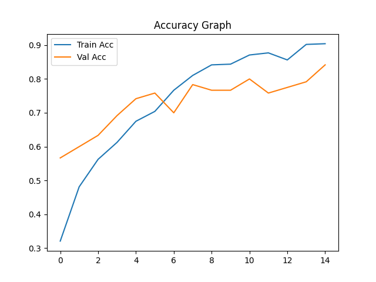

# skin-disease-detection-cnn

CNN-based skin disease classification system developed for automated detection of common skin diseases using deep learning and image processing techniques.

## Project Overview

Skin diseases affect millions of people worldwide and often require specialist diagnosis for accurate identification. This project utilizes Convolutional Neural Networks (CNNs) to automatically classify skin diseases from images, providing a supportive diagnostic tool for preliminary screening.

The system is trained to identify four common skin conditions:

- Atopic Dermatitis
- Eczema
- Melanoma
- Ringworm

The model analyzes skin lesion images and learns visual patterns such as texture, color variation, and lesion structure to perform accurate classification.

## Disease Classes

### Atopic Dermatitis

*Figure 1: Sample image of Atopic Dermatitis.*

### Eczema

*Figure 2: Sample image of Eczema.*

### Melanoma

*Figure 3: Sample image of Melanoma.*

### Ringworm

*Figure 4: Sample image of Ringworm.*

## Objectives

- Develop a CNN-based image classification model.
- Automatically extract disease-specific visual features.
- Classify four common skin diseases.
- Improve accessibility to preliminary diagnosis.
- Support healthcare professionals with AI-assisted screening.

## System Architecture

*Figure 5: CNN-based Skin Disease Detection Pipeline.*

## Workflow

1. Input Skin Image
2. Image Preprocessing
3. Data Augmentation
4. CNN Feature Extraction
5. Disease Classification
6. Prediction Generation
7. Display Result with Confidence Score

## Dataset

The dataset consists of skin disease images categorized into:

- Atopic Dermatitis
- Eczema
- Melanoma
- Ringworm

### Dataset Characteristics:

- Approximately 120 images
- RGB Images
- JPEG / PNG format
- Resized to 180×180 pixels
- Data Augmentation Applied

## Data Preprocessing

The following preprocessing techniques were used:

- Image Resizing (180×180)
- Pixel Normalization
- Horizontal Flipping
- Random Rotation
- Random Zoom
- Dataset Splitting (80% Training, 20% Validation)

## CNN Architecture

The model consists of four convolutional blocks:

### Block 1

- Conv2D (32 Filters)
- Batch Normalization
- MaxPooling

### Block 2

- Conv2D (64 Filters)
- Batch Normalization
- MaxPooling

### Block 3

- Conv2D (128 Filters)
- Batch Normalization
- MaxPooling

### Block 4

- Conv2D (256 Filters)
- Batch Normalization
- MaxPooling

### Fully Connected Layers

- Flatten Layer
- Dense Layer (128 Neurons)
- Dropout (0.3)
- Output Layer (4 Classes)

## Model Training

### Training Configuration:

- Framework: TensorFlow / Keras
- Optimizer: Adam
- Epochs: 25
- Batch Size: 16
- Early Stopping Enabled

## Technologies Used

- Python
- TensorFlow
- Keras
- NumPy
- Matplotlib
- OpenCV
- VS Code

## Source Code

### Training Script

[Training Code](code/train.py)

### Prediction Script

[Prediction Code](code/predict.py)

### Dataset

[View Dataset](dataset/)

## Results

The trained model achieved approximately:

- Validation Accuracy: ~90%
- Multi-Class Classification
- Reliable Disease Prediction

### Atopic Dermatitis Prediction

*Figure 6: CNN correctly classified Atopic Dermatitis.*

### Eczema Prediction

*Figure 7: CNN correctly classified Eczema.*

### Melanoma Prediction

*Figure 8: CNN correctly classified Melanoma.*

### Ringworm Prediction

*Figure 9: CNN correctly classified Ringworm.*

### Model Performance

*Figure 10: Training and validation accuracy during CNN training.*

## Applications

- Preliminary Skin Disease Screening
- Rural Healthcare Assistance
- Telemedicine Platforms
- Mobile Health Applications
- Clinical Decision Support
- Medical Education

## Future Scope

- Larger Dataset Integration
- Additional Skin Disease Categories
- Transfer Learning using ResNet/VGG/EfficientNet
- Mobile Application Deployment
- Web-Based Prediction System
- Real-Time Camera Analysis
- Hospital System Integration

## Documentation

[View Project Report](docs/ai-project-report.pdf)

## Author

* Ansh Taralekar

Electronics & Telecommunication Engineering
K. J. Somaiya Institute of Technology 
GitHub: https://github.com/anshtaralekar
